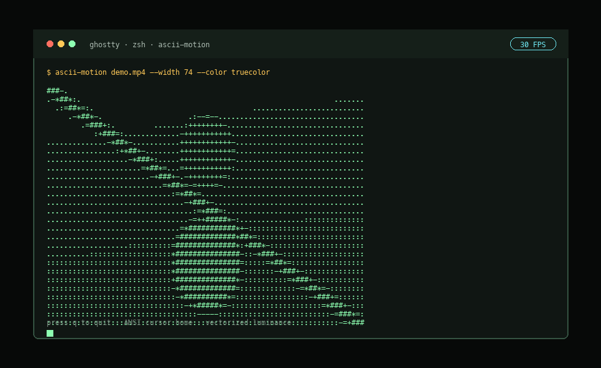

# ascii-motion

[](https://github.com/c4rl0s04/ascii-motion/actions/workflows/pages.yml)
[](https://github.com/c4rl0s04/ascii-motion/actions/workflows/ci.yml)
[](LICENSE)
[](https://c4rl0s04.github.io/ascii-motion/)

`ascii-motion` plays video files as real-time ASCII animations directly inside an ANSI-compatible terminal. The pipeline uses OpenCV for frame capture, NumPy for matrix-based processing, and ANSI escape sequences for flicker-resistant rendering without clearing the whole screen on every frame.



## Landing Page

The static promotional site lives in [`site/`](site/) and is published with GitHub Pages:

https://c4rl0s04.github.io/ascii-motion/

To view it locally:

```bash
python3 -m http.server 8765 --directory site
```

Then open `http://127.0.0.1:8765/` in your browser.


Mobile view:


## Installation

Install with Homebrew on macOS:

```bash
brew install c4rl0s04/ascii-motion/ascii-motion
```

Or tap first:

```bash
brew tap c4rl0s04/ascii-motion
brew install ascii-motion
```

Local development install:

```bash
python3 -m venv .venv
source .venv/bin/activate
pip install -e ".[dev]"
```

Local usage-only install:

```bash
pip install .
```

## Basic Usage

```bash
ascii-motion video.mp4
ascii-motion video.mp4 --width 120
ascii-motion video.mp4 --width 160 --fps 60
ascii-motion video.mp4 --loop
ascii-motion 0 --width 100
```

It also works as a Python module:

```bash
python -m ascii_motion video.mp4
```

## Options

### Source And Sizing

- `source`: video path or camera index. Use `0` for the default webcam.
- `-w, --width COLUMNS`: target ASCII width. If omitted, the current terminal width is used.
- `--height ROWS`: target ASCII height. If omitted, height is calculated from the source aspect ratio.
- `--fit-terminal`: fit output to the current terminal size. When HUD/progress are visible, rows are reserved for those lines.

Terminal characters are usually taller than they are wide, so automatic height uses a `0.5` character aspect correction.

Examples:

```bash
ascii-motion video.mp4 --width 120
ascii-motion video.mp4 --width 120 --height 40
ascii-motion video.mp4 --fit-terminal
ascii-motion 0 --width 100
```

### Playback Timing

- `--fps FPS`: override source FPS. If omitted, the video FPS is used.
- `--start SECONDS`: start playback from a timestamp.
- `--duration SECONDS`: stop playback after the given duration.
- `--loop`: restart the source when it reaches the end.
- `--real-time`: skip source frames when processing or terminal output falls behind wall-clock playback.

Examples:

```bash
ascii-motion video.mp4 --fps 60
ascii-motion video.mp4 --start 10 --duration 5
ascii-motion video.mp4 --loop
ascii-motion video.mp4 --real-time --benchmark
```

### Interactive Controls

Default controls during interactive playback:

```text
q              quit
space          pause / resume
left arrow     seek backward
right arrow    seek forward
h              seek backward fallback
l              seek forward fallback
?              show / hide controls
```

Control options:

- `--quit-key KEY`: change the quit key. Default: `q`.
- `--pause-key KEY`: change the pause/resume key. Default: space.
- `--backward-key KEY`: change the backward seek fallback key. Default: `h`.
- `--forward-key KEY`: change the forward seek fallback key. Default: `l`.
- `--help-key KEY`: change the controls overlay toggle key. Default: `?`.
- `--seek-seconds SECONDS`: seconds moved by each seek command. Default: `5`.

Examples:

```bash
ascii-motion video.mp4 --quit-key x
ascii-motion video.mp4 --pause-key p
ascii-motion video.mp4 --backward-key j --forward-key k --seek-seconds 10
```

### HUD, Progress And Terminal Rendering

- `--no-hud`: hide the compact playback status line.
- `--no-progress`: hide the progress bar.
- `--show-controls`: show the controls line from the start instead of waiting for `?`.
- `--no-alt-screen`: render in the normal terminal buffer instead of the alternate screen.
- `--benchmark`: print performance metrics to stderr after playback/export.

The renderer uses `\033[H` to return the cursor to the top-left before writing each frame. It does not clear the full screen per frame.

Examples:

```bash
ascii-motion video.mp4 --no-hud --no-progress
ascii-motion video.mp4 --show-controls
ascii-motion video.mp4 --no-alt-screen
ascii-motion video.mp4 --benchmark
```

### Character Sets And Visual Modes

- `--charset classic|dense|blocks|custom`: choose a built-in character ramp or a custom one.
- `--chars "..."`: provide a custom dark-to-light character ramp. Use with `--charset custom` or to override another charset.
- `--invert`: reverse the selected character ramp.
- `--mode ascii|edges|hybrid`: choose standard luminance ASCII, Sobel edge emphasis, or a luminance/edge blend.
- `--dither none|ordered`: apply no dithering or ordered Bayer dithering before character mapping.
- `--list-charsets`: print available character sets and exit.

Examples:

```bash
ascii-motion video.mp4 --charset dense
ascii-motion video.mp4 --charset blocks
ascii-motion video.mp4 --charset custom --chars " .oO@"
ascii-motion video.mp4 --chars " .oO@" --invert
ascii-motion video.mp4 --mode edges
ascii-motion video.mp4 --mode hybrid --dither ordered
ascii-motion --list-charsets
```

### Color

- `--color none`: emit plain text only. This is the default and fastest mode.
- `--color truecolor`: emit 24-bit ANSI foreground color.
- `--color 256`: emit ANSI 256-color foreground color.
- `--color grayscale`: emit ANSI 256-color grayscale foreground color based on luminance.

Examples:

```bash
ascii-motion video.mp4 --color truecolor
ascii-motion video.mp4 --color 256
ascii-motion video.mp4 --color grayscale
```

### Preview, Snapshot And Export

Non-interactive modes do not use alternate screen or keyboard controls.

- `--preview`: print source metadata, selected output dimensions, FPS, charset, mode, dithering, and color settings.
- `--frame-at SECONDS`: render one frame at a timestamp to stdout.
- `--export PATH`: export a plain text animation to one file. Frames are separated with form feed `\f`.
- `--export-ansi PATH`: export an ANSI animation file with cursor-home sequences between frames.
- `--export-frames DIR`: export each processed frame as a numbered text file.

Examples:

```bash
ascii-motion video.mp4 --preview
ascii-motion video.mp4 --frame-at 5.0 --width 100 > frame.txt
ascii-motion video.mp4 --export output.txt --width 100 --duration 5
ascii-motion video.mp4 --export-ansi output.ans --width 100 --duration 5 --color 256
ascii-motion video.mp4 --export-frames frames --start 2 --duration 4
```

Use `--frame-at` when you want exactly one saved frame:

```bash
ascii-motion video.mp4 --frame-at 12.5 --width 120 > frame.txt
```

Use `--export-frames` when you want many files, one per processed frame in the selected time range.

### Metadata

- `--version`: print the installed package version.
- `-h, --help`: print CLI help.

## Technical Pipeline

```text
VideoCapture -> resize -> luminance/edges/dither -> LUT ASCII -> ANSI render/export
```

Luminance uses the Rec. 709 formula:

```text
Y = 0.2126R + 0.7152G + 0.0722B
```

OpenCV provides frames in BGR order, so the processor reads `R` from channel `2`, `G` from channel `1`, and `B` from channel `0`.

## Performance Notes

Grayscale-to-character mapping is performed with NumPy over full matrices. There are no nested Python loops walking pixel by pixel. Final text conversion happens by row, which is the practical boundary between matrix processing and terminal output.

`--real-time` can skip frames when processing or terminal rendering is late. This prioritizes wall-clock playback over rendering every source frame.

`--mode edges` uses Sobel gradients to emphasize contours. `--mode hybrid` blends luminance and edges. `--dither ordered` applies vectorized Bayer dithering before character mapping.

Terminal output can be the main bottleneck at large widths, especially with ANSI color enabled. On modern terminals such as Ghostty, `--width 120` or `--width 160` is a reasonable range for testing 30/60 FPS depending on the video and machine.

To measure the pipeline:

```bash
ascii-motion video.mp4 --width 120 --benchmark
```

## Recommended Manual Validation

```bash
ascii-motion sample.mp4 --width 80
ascii-motion sample.mp4 --width 120
ascii-motion sample.mp4 --width 160 --benchmark
ascii-motion sample.mp4 --loop
ascii-motion sample.mp4 --real-time --benchmark
ascii-motion sample.mp4 --mode edges
ascii-motion sample.mp4 --color 256
ascii-motion sample.mp4 --preview
ascii-motion sample.mp4 --frame-at 5 --width 100
ascii-motion sample.mp4 --export output.txt --duration 3
ascii-motion 0 --width 100
```

Also test `Ctrl+C` and confirm the cursor is visible and the terminal is restored.

## Limitations

- No audio playback.
- No GUI.
- No required `curses` dependency.
- GIF export is not a runtime feature.
- `blocks` uses Unicode characters; the default `classic` charset is pure ASCII.
- Very large output sizes increase stdout write cost and can reduce effective FPS.
