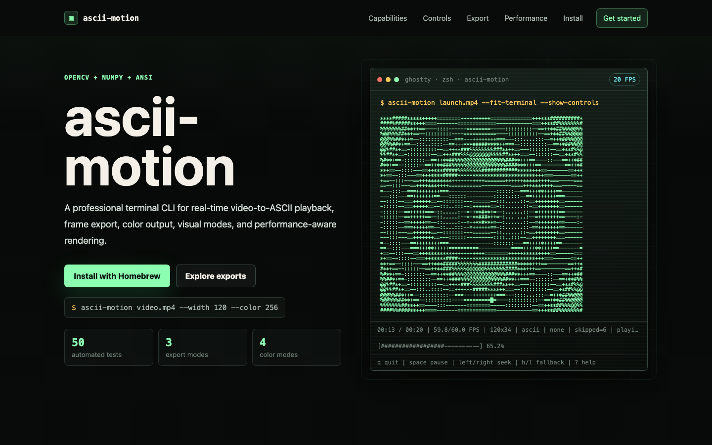
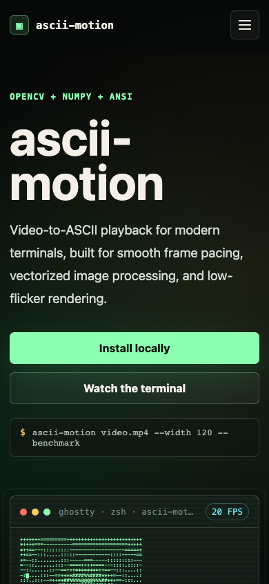

# ascii-motion

[](https://github.com/c4rl0s04/ascii-motion/actions/workflows/pages.yml)
[](https://github.com/c4rl0s04/ascii-motion/actions/workflows/ci.yml)
[](LICENSE)
[](https://c4rl0s04.github.io/ascii-motion/)

`ascii-motion` reproduce archivos de video como animaciones ASCII directamente en una terminal ANSI. El pipeline usa OpenCV para capturar frames, NumPy para procesarlos por matriz y secuencias ANSI para renderizar sin limpiar toda la pantalla en cada frame.

## Landing Page

La pagina promocional estatica esta en [`site/`](site/). Cuando GitHub Pages termine el despliegue, estara disponible en:

https://c4rl0s04.github.io/ascii-motion/

Para verla localmente:

```bash
python3 -m http.server 8765 --directory site
```

Abre `http://127.0.0.1:8765/` en el navegador.



Vista movil:



## Instalacion

Con Homebrew en macOS Apple Silicon:

```bash
brew install c4rl0s04/ascii-motion/ascii-motion
```

O bien:

```bash
brew tap c4rl0s04/ascii-motion
brew install ascii-motion
```

Instalacion local para desarrollo:

```bash
python3 -m venv .venv
source .venv/bin/activate
pip install -e ".[dev]"
```

Tambien se puede instalar solo para uso:

```bash
pip install .
```

## Uso Basico

```bash
ascii-motion video.mp4
ascii-motion video.mp4 --width 120
ascii-motion video.mp4 --width 160 --fps 60
ascii-motion video.mp4 --loop
ascii-motion 0 --width 100
```

Tambien funciona como modulo:

```bash
python -m ascii_motion video.mp4
```

## Opciones Relevantes

```bash
ascii-motion video.mp4 --fit-terminal
ascii-motion video.mp4 --charset dense
ascii-motion video.mp4 --charset blocks
ascii-motion video.mp4 --chars " .oO@" --invert
ascii-motion video.mp4 --start 10 --duration 5
ascii-motion video.mp4 --benchmark
ascii-motion video.mp4 --no-alt-screen
ascii-motion video.mp4 --color truecolor
ascii-motion --list-charsets
ascii-motion --version
```

`--fit-terminal` fuerza el tamano de salida al ancho y alto actuales de la terminal. Sin esa opcion, el ancho por defecto es el ancho de terminal y la altura se calcula preservando el aspecto visual del video.

## Pipeline Tecnico

```text
VideoCapture -> resize -> luminance -> LUT ASCII -> ANSI render
```

La luminancia se calcula con la formula Rec. 709:

```text
Y = 0.2126R + 0.7152G + 0.0722B
```

OpenCV entrega frames en formato BGR, por lo que el procesador toma `R` desde el canal 2, `G` desde el canal 1 y `B` desde el canal 0.

## Rendimiento

El mapeo de escala de grises a caracteres se realiza con NumPy sobre matrices completas. No hay bucles `for` anidados iterando pixel por pixel. La conversion final a texto trabaja por filas, que es el punto razonable de cruce entre matriz y salida estandar.

El renderizado evita flickering usando `\033[H` para reposicionar el cursor en la esquina superior izquierda antes de escribir cada frame. La pantalla completa solo se limpia al iniciar. Por defecto se usa alternate screen para no ensuciar el scrollback y para restaurar mejor la terminal al salir.

Para medir el coste del pipeline:

```bash
ascii-motion video.mp4 --width 120 --benchmark
```

La terminal puede ser el cuello de botella principal en anchos altos. En terminales modernas como Ghostty, usar `--width 120` o `--width 160` suele ser un rango razonable para probar 30/60 FPS, dependiendo del video y del equipo.

## Validacion Manual Recomendada

```bash
ascii-motion sample.mp4 --width 80
ascii-motion sample.mp4 --width 120
ascii-motion sample.mp4 --width 160 --benchmark
ascii-motion sample.mp4 --loop
ascii-motion 0 --width 100
```

Tambien conviene interrumpir con `Ctrl+C` y confirmar que el cursor queda visible y la terminal vuelve a su estado normal.

## Limitaciones

- No reproduce audio.
- No usa GUI.
- No depende de `curses`.
- El modo `blocks` usa caracteres Unicode; el modo por defecto `classic` es ASCII puro.
- La salida muy grande aumenta el coste de escritura en stdout y puede bajar el FPS efectivo.
